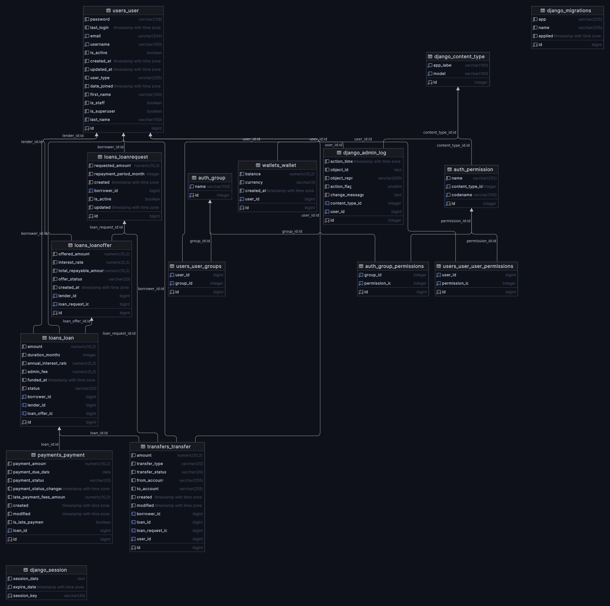

# Lenme

Lenme is a Django-based project that offers loan management functionalities, including loan requests, offers, and payments.

## Features

### **Users**
The user system allows for two primary types of users:
- **Borrowers**: Individuals seeking to request loans.
- **Lenders**: Individuals or entities offering loans to borrowers.

### **Loan Requests**
This component allows users (borrowers) to create and manage loan requests. A loan request includes details such as the requested amount and repayment period. The system supports:
- Creating a new loan request.
- Viewing and managing existing loan requests.
- Status tracking of each request.

### **Loan Offers**
Lenders can create offers for available loan requests. The system supports:
- Creating new loan offers.
- Viewing and managing existing loan offers.
- Associating offers with specific loan requests.
- Validating lender’s funds before creating an offer.

### **Payments**
Handles the processing of payments for loans. The payment system ensures:
- Accurate payment processing.
- Updating loan statuses based on payment completions.
- Tracking overdue payments.
- Managing payment statuses and related transfers.

### **Transfers**
Manages the transfer of funds between lenders and borrowers. Key features include:
- Creating transfer records for both lenders and borrowers.
- Handling fund transfers in response to loan payments.
- Ensuring accurate balance updates for both parties.

### **Wallet**
The wallet system manages the balance for both lenders and borrowers. It includes:
- Tracking user balances.
- Updating balances in response to payments and transfers.
- Ensuring sufficient funds before processing loan offers and payments.

## Requirements

- Docker
- Docker Compose

## Setup

### 1. Clone the Repository

```bash
git clone git@github.com:youssef-99/lenme.git
cd lenme
```

### Setup Environment
1. **Copy Environment File**

   Copy the `.env.example` file to `.env`:

   ```bash
   cp .env.example .env
    ```
### Build and Run with Docker

1. **Build the Docker Images**

   Build the Docker images for the project using Docker Compose. This step compiles your Dockerfiles and sets up the necessary images:

   ```bash
   docker compose up --build
   ```
   
## Running Tests

To ensure the functionality of the application, run the tests using the following command:

```bash
docker compose run --rm app sh -c "python manage.py test"
```
This command will execute the Django test suite inside the Docker container, allowing you to verify that all components of the application are working as expected.


### API Documentation

Lenme provides interactive API documentation using Swagger. You can use this documentation to explore and test the available API endpoints.

1. **Access Swagger Documentation**

   The API documentation is automatically generated and available at the following URL:

   ```markdown
   localhost:8000/api/v1/swagger/
   ```
   

## Database Schema

The following diagram illustrates the database schema for the Lenme project:



This image shows the relationships and structure of the database tables used in the application.
